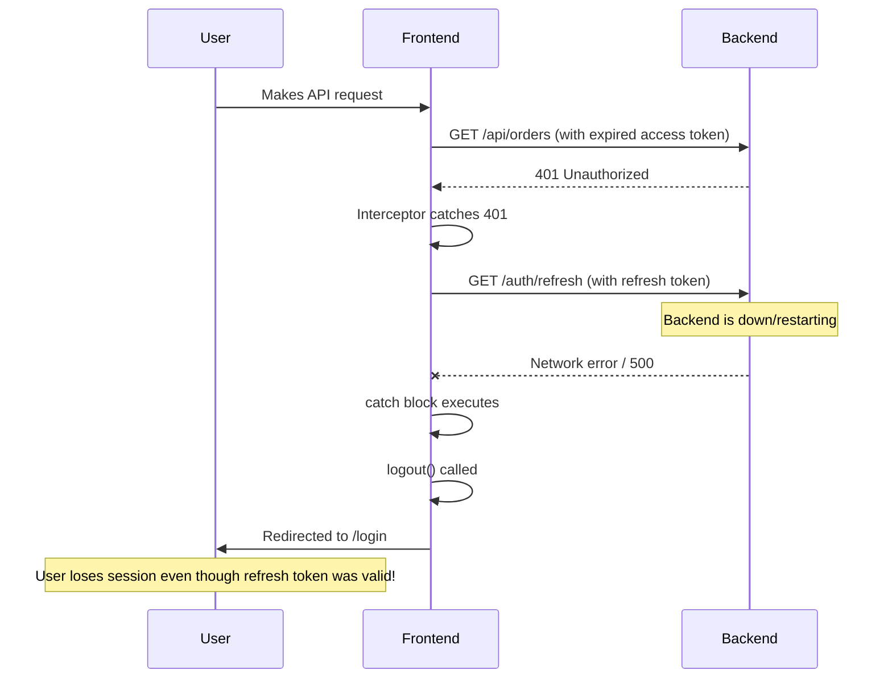
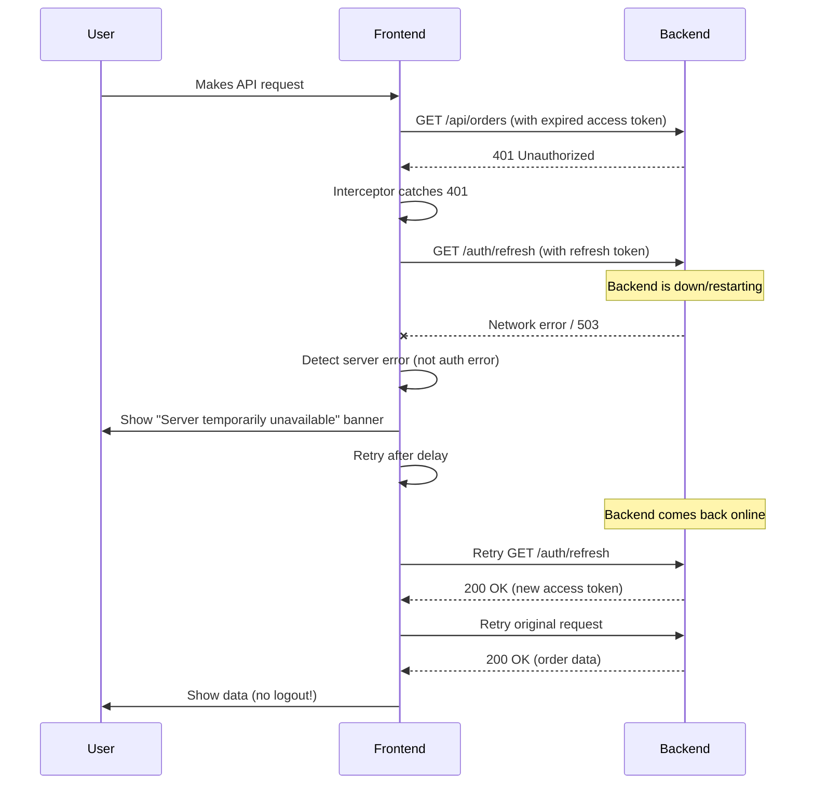

# Authentication Logout Issues - Problem Analysis

## Executive Summary

**Problem**: Users are logged out instantly when backend crashes, returns errors, or restarts.

**Root Cause**: The axios response interceptor treats **ALL** errors (including 5xx server errors and network failures) as potential authentication failures, triggering logout when refresh token operations fail.

**Impact**: Poor user experience, lost cart data, interrupted workflows.

---

## System Architecture Overview

### Authentication Method
✅ **Stateless JWT** with refresh tokens (NOT session-based)
- No cookies used for authentication
- No `SameSite` issues
- Access token: Short-lived (stored in memory)
- Refresh token: Long-lived (persisted in localStorage)

### Key Components

| Component | File | Purpose |
|-----------|------|---------|
| **Backend JWT Filter** | [JwtAuthenticationFilter.java](file:///c:/Users/namit/CompatX-Security/CompatX/src/main/java/com/namit/security/jwt/JwtAuthenticationFilter.java) | Validates access tokens |
| **JWT Utility** | [JwtUtil.java](file:///c:/Users/namit/CompatX-Security/CompatX/src/main/java/com/namit/security/jwt/JwtUtil.java) | Generates and validates tokens |
| **Auth Controller** | [AuthController.java](file:///c:/Users/namit/CompatX-Security/CompatX/src/main/java/com/namit/controllers/AuthController.java) | Login, refresh, logout endpoints |
| **Frontend Auth Store** | [useAuthStore.js](file:///c:/Users/namit/CompatX-Security/CompatX-frontend/src/stores/useAuthStore.js) | Zustand store for auth state |
| **Axios Client** | [axiosClient.js](file:///c:/Users/namit/CompatX-Security/CompatX-frontend/src/lib/axiosClient.js) | HTTP client with interceptors |

---

## Root Causes Identified

### 🔴 **Issue #1: Axios Interceptor Logout on Refresh Failure**

**Location**: [axiosClient.js:72-75](file:///c:/Users/namit/CompatX-Security/CompatX-frontend/src/lib/axiosClient.js#L72-L75)

```javascript
} catch (err) {
    console.error("❌ Token refresh failed. Logging out...", err.message);
    logout();  // ⚠️ PROBLEM: Logs out on ANY refresh failure
    return Promise.reject(err);
}
```

**Problem**:
- When backend is down/restarting, the refresh endpoint (`/auth/refresh`) fails with network error or 5xx
- The interceptor catches this error and **immediately logs out the user**
- This happens even though the refresh token is still valid

**Why This Happens**:
1. User makes API request → gets 401 (access token expired)
2. Interceptor tries to refresh token
3. Backend is down → refresh request fails with network error
4. Interceptor logs out user (lines 73-74)

---

### 🔴 **Issue #2: No Distinction Between Auth Errors and Server Errors**

**Location**: [axiosClient.js:58-76](file:///c:/Users/namit/CompatX-Security/CompatX-frontend/src/lib/axiosClient.js#L58-L76)

**Current Logic**:
```javascript
try {
    const res = await axios.get(`http://localhost:8080/api/v1/auth/refresh`, {
        params: { refreshToken },
    });
    // ... success handling
} catch (err) {
    // ⚠️ Catches EVERYTHING: 401, 403, 500, network errors
    logout();
}
```

**Problem**:
- No differentiation between:
  - ✅ **Legitimate auth failure** (401: invalid/expired refresh token) → Should logout
  - ❌ **Server error** (500, 503) → Should NOT logout
  - ❌ **Network error** (backend down) → Should NOT logout

---

### 🔴 **Issue #3: Refresh Token Rehydration on Page Load**

**Location**: [useAuthStore.js:51-73](file:///c:/Users/namit/CompatX-Security/CompatX-frontend/src/stores/useAuthStore.js#L51-L73)

```javascript
rehydrateAccessToken: async () =\u003e {
    // ... code ...
    try {
        const res = await axios.post("http://localhost:8080/api/v1/auth/refresh", ...);
        updateAccessToken(res.data.accessToken);
    } catch (error) {
        console.error(" Refresh failed. Logging out...", error);
        logout();  // ⚠️ PROBLEM: Logs out on page refresh if backend is down
    }
},
```

**Problem**:
- Called on every page load/refresh
- If backend is temporarily down during page load → user is logged out
- This is why users get logged out after backend restarts

---

### 🟡 **Issue #4: No Retry Logic for Transient Failures**

**Location**: [axiosClient.js](file:///c:/Users/namit/CompatX-Security/CompatX-frontend/src/lib/axiosClient.js)

**Missing Features**:
- No retry with exponential backoff for 5xx errors
- No queue for concurrent requests during token refresh
- No offline detection or reconnect handling

---

### 🟡 **Issue #5: Backend Doesn't Return Proper Error Codes**

**Location**: [AuthController.java:62-81](file:///c:/Users/namit/CompatX-Security/CompatX/src/main/java/com/namit/controllers/AuthController.java#L62-L81)

**Current Refresh Endpoint**:
```java
@PostMapping("/refresh")
public ResponseEntity<?> refreshToken(@RequestParam("refreshToken") String refreshTokenStr) {
    RefreshToken refreshToken = refreshTokenService.getByToken(refreshTokenStr);
    refreshTokenService.verifyExpiration(refreshToken);
    // ... generates new token
}
```

**Problem**:
- If `getByToken()` throws exception → returns 500 (not 401)
- If `verifyExpiration()` throws → returns 500 (not 401)
- Frontend can't distinguish between "invalid token" vs "server error"

---

## Detailed Flow Analysis

### Current Flow (Broken)



### Expected Flow (Correct)



---

## Files Requiring Changes

### Backend

1. **[AuthController.java](file:///c:/Users/namit/CompatX-Security/CompatX/src/main/java/com/namit/controllers/AuthController.java)**
   - Lines 62-81: Add proper exception handling in refresh endpoint
   - Return 401 for invalid/expired tokens
   - Return 500 only for actual server errors

2. **[RefreshTokenService.java](file:///c:/Users/namit/CompatX-Security/CompatX/src/main/java/com/namit/security/jwt/RefreshTokenService.java)** (need to check)
   - Ensure proper exceptions are thrown for invalid tokens

3. **Global Exception Handler** (need to create if doesn't exist)
   - Distinguish between auth errors and server errors
   - Return appropriate HTTP status codes

### Frontend

1. **[axiosClient.js](file:///c:/Users/namit/CompatX-Security/CompatX-frontend/src/lib/axiosClient.js)**
   - Lines 58-76: Fix refresh error handling
   - Lines 27-82: Add retry logic for 5xx errors
   - Add concurrent request queue during refresh

2. **[useAuthStore.js](file:///c:/Users/namit/CompatX-Security/CompatX-frontend/src/stores/useAuthStore.js)**
   - Lines 51-73: Fix rehydration error handling
   - Don't logout on server errors during page load

3. **[ProtectedRoute.jsx](file:///c:/Users/namit/CompatX-Security/CompatX-frontend/src/components/auth/ProtectedRoute.jsx)** (need to check)
   - Ensure it doesn't treat server errors as auth failures

---

## Summary of Findings

| Issue | Severity | Impact | File | Lines |
|-------|----------|--------|------|-------|
| Logout on refresh failure | 🔴 Critical | Users logged out on backend restart | axiosClient.js | 72-75 |
| No error type distinction | 🔴 Critical | Can't tell auth error from server error | axiosClient.js | 58-76 |
| Rehydration logout | 🔴 Critical | Logout on page load if backend down | useAuthStore.js | 51-73 |
| No retry logic | 🟡 High | Poor UX during transient failures | axiosClient.js | All |
| Backend error codes | 🟡 High | Returns 500 instead of 401 | AuthController.java | 62-81 |
| No concurrent refresh guard | 🟢 Medium | Multiple refresh requests | axiosClient.js | 58-76 |

---

## Next Steps

1. ✅ **Immediate Fix** (Backend): Update refresh endpoint to return proper error codes
2. ✅ **Immediate Fix** (Frontend): Fix axios interceptor to not logout on server errors
3. ✅ **High Priority**: Add retry logic with exponential backoff
4. ✅ **High Priority**: Fix rehydration to handle server errors gracefully
5. ⚠️ **Medium Priority**: Add concurrent refresh request queue
6. ⚠️ **Medium Priority**: Add UI feedback for server errors

---

## Testing Checklist

- [ ] Backend restart: User stays logged in
- [ ] 5xx error: User sees error message, not logged out
- [ ] Invalid refresh token: User is logged out (correct behavior)
- [ ] Network error: User sees retry option, not logged out
- [ ] Page refresh during backend downtime: User stays logged in
- [ ] Concurrent API calls with expired token: Single refresh request
