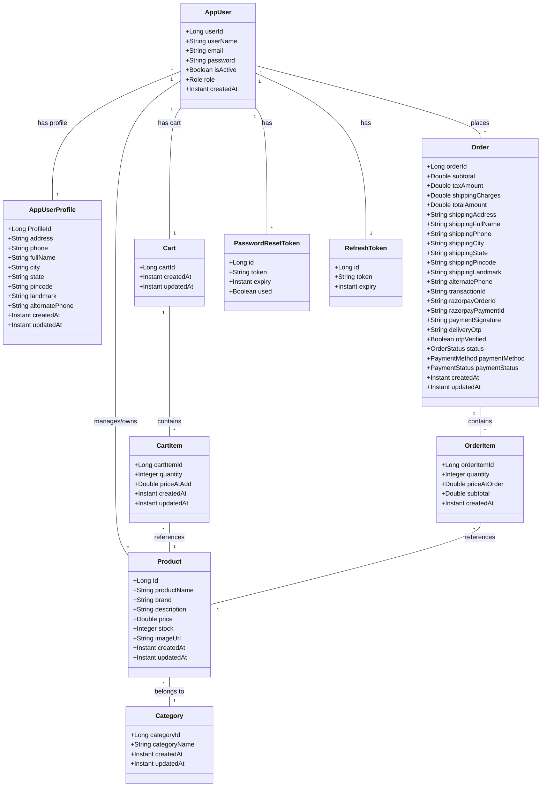

# Entity Class Diagram

This diagram represents the entity models and their relationships found in `com.namit.models`. You can use this to create your diagram in StarUML.

```mermaid
classDiagram
    class AppUser {
        +Long userId
        +String userName
        +String email
        +String password
        +Boolean isActive
        +Role role
        +Instant createdAt
    }

    class AppUserProfile {
        +Long ProfileId
        +String address
        +String phone
        +String fullName
        +String city
        +String state
        +String pincode
        +String landmark
        +String alternatePhone
        +Instant createdAt
        +Instant updatedAt
    }

    class Cart {
        +Long cartId
        +Instant createdAt
        +Instant updatedAt
    }

    class CartItem {
        +Long cartItemId
        +Integer quantity
        +Double priceAtAdd
        +Instant createdAt
        +Instant updatedAt
    }

    class Category {
        +Long categoryId
        +String categoryName
        +Instant createdAt
        +Instant updatedAt
    }

    class Order {
        +Long orderId
        +Double subtotal
        +Double taxAmount
        +Double shippingCharges
        +Double totalAmount
        +String shippingAddress
        +String shippingFullName
        +String shippingPhone
        +String shippingCity
        +String shippingState
        +String shippingPincode
        +String shippingLandmark
        +String alternatePhone
        +String transactionId
        +String razorpayOrderId
        +String razorpayPaymentId
        +String paymentSignature
        +String deliveryOtp
        +Boolean otpVerified
        +OrderStatus status
        +PaymentMethod paymentMethod
        +PaymentStatus paymentStatus
        +Instant createdAt
        +Instant updatedAt
    }

    class OrderItem {
        +Long orderItemId
        +Integer quantity
        +Double priceAtOrder
        +Double subtotal
        +Instant createdAt
    }

    class PasswordResetToken {
        +Long id
        +String token
        +Instant expiry
        +Boolean used
    }

    class Product {
        +Long Id
        +String productName
        +String brand
        +String description
        +Double price
        +Integer stock
        +String imageUrl
        +Instant createdAt
        +Instant updatedAt
    }

    class RefreshToken {
        +Long id
        +String token
        +Instant expiry
    }

    %% Relationships

    %% AppUser Relationships
    AppUser "1" -- "1" AppUserProfile : has profile
    AppUser "1" -- "1" Cart : has cart
    AppUser "1" -- "*" Order : places
    AppUser "1" -- "*" Product : manages/owns
    AppUser "1" -- "*" PasswordResetToken : has
    AppUser "1" -- "1" RefreshToken : has

    %% Cart Relationships
    Cart "1" -- "*" CartItem : contains

    %% CartItem Relationships
    CartItem "*" -- "1" Product : references

    %% Order Relationships
    Order "1" -- "*" OrderItem : contains

    %% OrderItem Relationships
    OrderItem "*" -- "1" Product : references

    %% Product Relationships
    Product "*" -- "1" Category : belongs to
```
